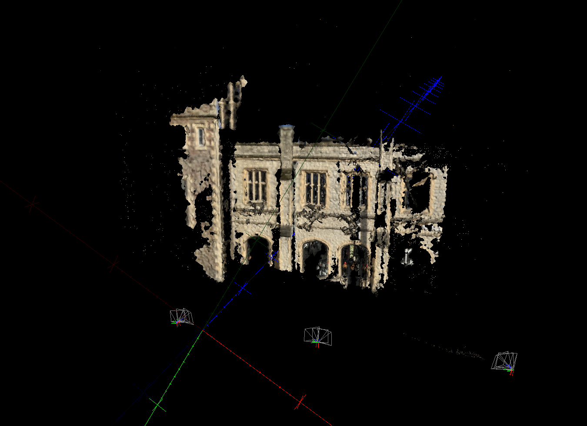

# 3D Photogrammetry Reconstruction Example

Example scripts and data from my Bristech talk. Slides at www.iainwallace.co.uk

## Prerequisites 

Clone and build MVE in this directory:

	git clone https://github.com/simonfuhrmann/mve.git
	cd mve
	make -j

If you want to use UVME to visualise the steps then also:

	cd mve
	cd apps/umve
	qmake -qt=qt5
	make -j

See the MVE repo for the prerequisites for it.

## I want to make a 3D model!

Put all your images in a folder, then run scripts 0-5 in turn with that name as an argument.

Provided as a test/example are my Engineshed photos. using that as an example:

	./0_mkscene.sh engineShed

You'll now have a `engineShed_scene`  folder, you can open this scene in UVME and see the photos. This is where the output goes.

	./1_sfm.sh engineShed

You'll run the sfm, have sparse features and camera locations. Reload the scene and look at the scene inspector. Check "draw sfm points" - you might need to move the view.

	./2_depth.sh engineShed

You now have per-image depth maps.

	./3_pset.sh engineShed

You can load `pset-L2.ply` in the scene viewer, this is your dense cloud.

	./4_surface.sh engineShed

Now you have `surface-L2.ply` to load - the surface reconstruction.

	./5_clean.sh engineShed

Now you've got the final cleaned mesh - `surface-L2-clean.ply`. It should look as below:

